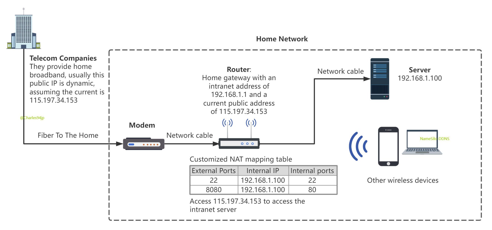

<h1 align="center">
  <a href="#">
  
  </a>
  <br>
</h1>

<p align="center">
<a href="https://github.com/Charles94jp/NameSilo-DDNS/tree/python"></a>  
<a target="_blank" href="https://opensource.org/licenses/MIT"></a>  
<a href="#python3"></a>
<a href="#table-of-contents"></a>
<a href="#features"></a>
<a href="#features"></a>
</p>

<h4 align="center"><a href="https://github.com/Charles94jp/NameSilo-DDNS#简体中文--english">简体中文</a> | English</h3>


NameSilo DDNS is a Dynamic Domain Name System service for NameSilo for home broadband, it can automatically detect IP changes in home broadband and automatically update the resolution of the domain name.

This program is only available for domain names purchased on NameSilo.

-->  ⭐  [Star](#)


# Features

- Simple but rich configuration.

- With email notification function, you can receive notification when your ip is changed or the program is exception.

- Support Docker.

- Log rotation.

- Support multiple domain name updates at the same time.

- Support IPv6.


# Table of Contents

- [1. Background](#1-background)
- [2. Quick Start](#2-quick-start)
- [3. Configuration](#3-configuration)
- [4. Note](#4-note)
- [5. Usage - Docker](#5-usage---docker)
    - [5.1 Build or Pull Image](#51-build-or-pull-image)
    - [5.2 RUN](#52-run)
    - [5.3 Start with Linux](#53-start-with-linux)
    - [5.4 Log - Docker](#54-log---docker)
- [6. Usage - Direct](#6-usage---direct)
    - [6.1 Install](#61-install)
    - [6.2 Start](#62-start)
    - [6.3 Log](#63-log)
    - [6.4 Start At Boot](#64-start-at-boot)
- [7. Links](#7-links)


# 1. Background

How to access the server at home from outside? we call it intranet penetration. IPv4 and IPv6 both have their own solutions.

### IPv4

At present, telecom operators assign to home broadband IP are dynamic, although the IP address is not fixed, but the good thing is that the home router can get a real public IP, so we just need to use **set Modem to Bridge Mode + use router for Broadband Authentication + router setup NAT Mapping/DMZ Host** to access the home device in the public network. After the router mapping port 22 we can remotely connect to our home linux machine, and after mapping port 445+3389 we can use the remote desktop of Win10.



To solve the problem of changing public IP, you can purchase a domain name and use DDNS (Dynamic Domain Name Server) to resolve the domain name to your broadband's IP. This will allow you to access your home devices by accessing a **fixed domain name**.

To achieve this, you need a computer that is always running to run this DDNS program.

### IPv6

Telecom operators are currently equipped with IPv6 addresses for broadband. Just enable the IPv6 function on the router, and make sure that the computer has an IPv6 address and a DNS server address to use IPv6 to connect to the Internet.

As long as the router's firewall policy does not restrict external network traffic from accessing the internal network, you can access internal network machines through IPv6 addresses without NET mapping!


# 2. Quick Start

Docker:

```shell
mkdir -p /home/docker/ddns
docker pull charles94jp/ddns
docker run -d --name ddns -v /home/docker/ddns:/home/NameSilo-DDNS:rw --network host charles94jp/ddns
# run command options: --restart=always
# run command options: -e TZ=Asia/Shanghai
cp /home/docker/ddns/conf/conf.json.example /home/docker/ddns/conf/conf.json
vi /home/docker/ddns/conf/conf.json
# Fill in the domain name and key
# Generate key here: https://www.namesilo.com/account/api-manager
docker restart ddns
```

Of course it can also be [run directly](#usage---direct) as a python program.


# 3. Configuration


The `conf/conf.json` file needs to be configured before starting, refer to conf.json.example. **Only two configurations, domains and key, are necessary**, the rest can be set without.


| Fields                 | Introduction                                                                                                                                                                                                                                                                                                                                                                                                              |
|------------------------|---------------------------------------------------------------------------------------------------------------------------------------------------------------------------------------------------------------------------------------------------------------------------------------------------------------------------------------------------------------------------------------------------------------------------|
| domains                | A record type domain name for IPv4. Support to update multiple domain names at the same time, support second-level domain names, third-level domain names, etc., such as `["cc.bb.cn","q.w.cc.cn"]`. If you only use IPv6, leave this blank.<br>This program can only update an existing DNS record, not create a new one. So you must first create a resolution on the NameSilo web page before you can run the program. |
| ~~domain~~             | An older version of the `domains` item, which is currently compatible. String type, only one domain name can be updated at a time.                                                                                                                                                                                                                                                                                        |
| domains_ipv6           | AAAA record type domain name for IPv6. If you only use IPv4, leave this blank. To use IPv6 in docker, the `run` command requires the `--network host` option.                                                                                                                                                                                                                                                             |
| ttl                    | Time to live of DNS records, in seconds.                                                                                                                                                                                                                                                                                                                                                                                  |
| key                    | <a target="_blank" href="https://www.namesilo.com/account/api-manager">The key generated from NameSilo</a>, after generation you need to remember and keep this key.                                                                                                                                                                                                                                                      |
| frequency              | How often do you detect changes in your ip, and only update your DNS when a change in ip occurs, in seconds.                                                                                                                                                                                                                                                                                                              |
| mail_host              | For example, you can use [Google Mail's POP/IMAP](https://support.google.com/mail/answer/7126229).                                                                                                                                                                                                                                                                                                                        |
| mail_port              | Must be SMTP SSL port.                                                                                                                                                                                                                                                                                                                                                                                                    |
| mail_user              | The login user name, which is also the email sender.                                                                                                                                                                                                                                                                                                                                                                      |
| mail_pass              | Password or key, for gmail, refer [here](https://support.google.com/accounts/answer/185833).                                                                                                                                                                                                                                                                                                                              |
| receivers              | Array to store the addresses of recipients. Receiver and sender can be the same address.                                                                                                                                                                                                                                                                                                                                  |
| mail_lang              | The language of the email. Default zh-cn, optional en-us.                                                                                                                                                                                                                                                                                                                                                                 |
| ~~email_after_reboot~~ | Deprecated since v2.2.0. When the power is lost unexpectedly, an email notification will be sent when the power is reapplied. If the server can start automatically after power on.                                                                                                                                                                                                                                       |
| auto_restart           | Effective under Linux and macOS, disabled by default. When enabled, the program will automatically restart when it encounters exceptions. Since v2.1.0, the robustness of the program has been improved and this option is no longer important.                                                                                                                                                                           |
| email_every_update     | Prerequisites: Linux; Set email configuration; Every time the IP is changed, an email will be sent to inform the new IP to avoid inaccessibility within ten or twenty minutes of DNS update.                                                                                                                                                                                                                              |


Q：What is the use of email function?

A：The following emails will be received: successful push ip to NameSilo; failed to push ip; program stopped due to unexpected circumstances; program restarted automatically

Q：How to enable the email function?

A：From mail_host to mail_pass, all 4 configurations are filled in correctly, and it will be enabled automatically


Test if your email settings are correct, an email will be sent to your email address if your configuration works.

```
DDNS testEmail
# or
python ddns.py --test-email
```


# 4. Note

This program can only update the DNS record of a domain name, it cannot be added, please make sure this DNS record exists for your domain name.


# 5. Usage - Docker

The advantage of Doker is that there is no need to install python environment, and there is no need to add scripts to systemctl in terms of starting with Linux.


## 5.1 Build or Pull Image

<b>Pull from Docker Hub</b>

```shell
docker pull charles94jp/ddns
```

This image is built based on the smallest Linux alpine image, Docker Hub shows 21.37M, `docker images` shows the image size is 57M.

The images in Docker Hub are not necessarily the latest, you can also choose to build the images manually


<b>Build docker image manually</b>

```shell
docker build -t charles94jp/ddns .
```


## 5.2 RUN

```shell
docker run -d --name ddns -v <local dir>:/home/NameSilo-DDNS:rw --network host charles94jp/ddns
# --restart=always
# -e TZ=Asia/Shanghai
```

Be sure to mount the local directory `<local dir>` to `/home/NameSilo-DDNS` in the container with the -v parameter, the container will write out the program files to `<local dir>`.

The default time zone is Asia/Shanghai (CST, +0800). If you don't use this time zone, you can modify it with the -e option, for example `-e TZ=US/Mountain`.

Then configure `conf/conf.json` in `<local dir>`, refer to [Configuration](#configuration)

Finally remember to restart the container, because at the beginning of ``docker run`` there is no configuration file, so the ddns program is not successfully run.

```shell
docker restart ddns
```

Use the `-network host` option for IPv6.

Check the status of the ddns program with ``ddns-docker`` in `<local dir>`.


## 5.3 Start with Linux

```shell
systemctl enable docker
docker update --restart=always ddns
```


## 5.4 Log - Docker

The logs are in the `<local dir>/log` folder

To view the running status of the program, and the history of updates. Run:

```shell
<local dir>/ddns-docker
```


View log files:

```
ls -lh log/DDNS*.log*
```


If `DDNS.log` exceeds 2M, it will trigger automatic archiving. It can store all the logs since DDNS was used.


# 6. Usage - Direct

Run the program directly on your host.

## 6.1 Install

Download and use:

```
git clone -b python https://github.com/Charles94jp/NameSilo-DDNS.git
```

The python 3 environment is required. The httpx module also needs to be installed.

```
pip install httpx
```

Update:

```
git pull origin python
```


## 6.2 Start


**Quick start**

```
python ddns.py
```


**Advanced use of Linux and Mac:**

The DDNS file is a powerful script that starts the ddns.py program in the background, detects if the program is running in the background, and kills the program.

Edit the DDNS file before use, modify the 8th line to be the **absolute path** of the NameSilo-DDNS project, and modify the 17th line to be the path of the python 3 executable file. This is done so that the project path can be found when using softlinks or setup programs that start up with the system.

Usage of `DDNS` script:

```
chmod +x DDNS
# usage
./DDNS {start|stop|status|restart|force-reload}
```

It functions like [Log - Docker](#log---docker), but more powerful.


If you want to use `DDNS` command anywhere, you can create a soft link in the `/usr/bin` directory, and note that the `ln` command should use the absolute path, such as :

```
ln -s /root/NameSilo-DDNS/DDNS /usr/bin/DDNS
```


**Windows usage:** Double-click the bat or vbs file, please check the log for the running status of the program.


## 6.3 Log

The logs are in the log folder.

<b>Linux</b>

View log files

```
ls -lh log/DDNS*.log*
```

If `DDNS.log` exceeds 2M, it will trigger automatic archiving. It can store all the logs since DDNS was used.

Manually archived logs for when `DDNS status` prints too many messages.

```
DDNS archiveLog
# or
python ddns.py --archive
```


<b>Windows</b>

When DDNS service starts, if `DDNS.log` exceeds 2M, the old `DDNS.log` file will be renamed to `DDNS-xxx.log.back`.

Manually archived logs.

```
python ddns.py archiveLog
```


## 6.4 Start At Boot

<b>Linux</b>

To start at boot, only RedHat series such as CentOS 7 8 and Rocky Linux 8 are demonstrated, please write your own script for other Linux distributions.

Register DDNS as a service managed by systemctl.

First of all, follow the steps in [start](#start) to configure the DDNS file.

Then configure the DDNS.service file, modify the path of DDNS file in it, and finally run:

```
cp  ./DDNS.service  /usr/lib/systemd/system/DDNS.service
systemctl daemon-reload
systemctl enable DDNS
```


<b>Windows</b>

Add the vbs file to the Windows policy group.


# 7. Links

- [Docker Hub](https://hub.docker.com/r/charles94jp/ddns/tags)
- NameSilo API Document: [Domain API Reference - NameSilo](https://www.namesilo.com/api-reference#dns/dns-list-records)
- Current IP query: [speedtest.cn](https://www.speedtest.cn/) ; [NJU speed test](http://test.nju.edu.cn/) ; [myip.com](https://www.myip.com/api-docs/) ; [ipify](https://www.ipify.org/)
- Current IPv6 query: [USTC speed test](http://test6.ustc.edu.cn/) ; [ipify](https://www.ipify.org/) ; [Tsinghua University IPv6](https://ipv6.tsinghua.edu.cn/)

