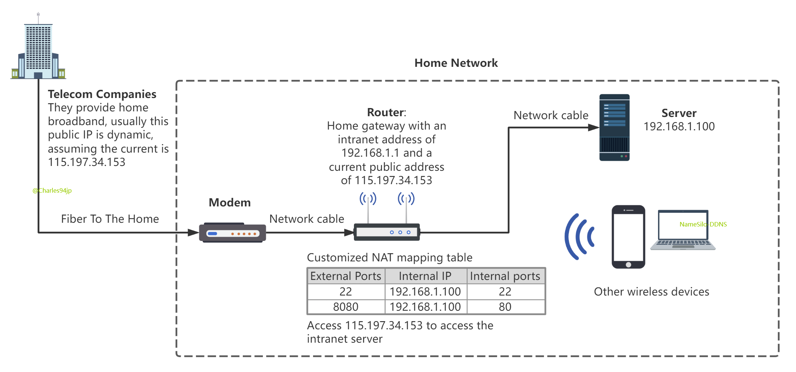
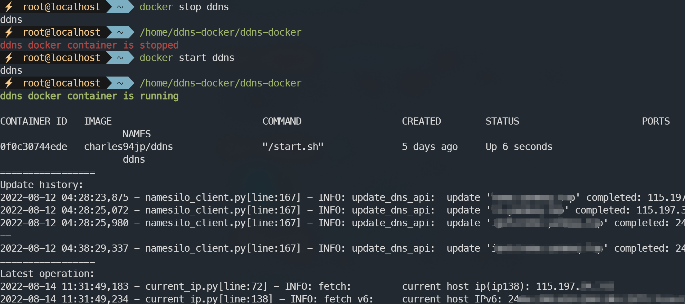

<h1 align="center">
  <a href="#">
  
  </a>
  <br>
</h1>

<p align="center">
<a href="https://github.com/Charles94jp/NameSilo-DDNS/tree/python"></a>  
<a target="_blank" href="https://opensource.org/licenses/MIT"></a>  
<a href="#python3"></a>
<a href="#table-of-contents"></a>
<a href="#features"></a>
<a href="#features"></a>
</p>

<h4 align="center"><a href="https://github.com/Charles94jp/NameSilo-DDNS/blob/python/readme.zh-CN.md">简体中文</a> | English</h3>


NameSilo DDNS is a Dynamic Domain Name System service for NameSilo for home broadband, it can automatically detect IP changes in home broadband and automatically update the resolution of the domain name.

This project has been refactored via Python3, to view the Java version please switch branches.

This program is only available for domain names purchased on NameSilo.

This program obtains the public IP address of home broadband by visiting http://202x.ip138.com or https://api.myip.com or https://api.ipify.org?format=json, and queries and updates the DNS status by https://www.namesilo.com/api/.

It would be the best encouragement for me to get your  ⭐ STAR.

# Features

- Simple but rich configuration.

- With email alert function, you will be alerted when there is an abnormality in the process of the service running for a long time.

- Support Docker.

- Log rotation.

# Table of Contents

- [Background](#background)
- [Install](#install)
    - [Dependencies](#dependencies)
- [Usage](#usage)
    - [Configuration](#configuration)
    - [Note](#note)
    - [Start](#start)
    - [Log](#log)
    - [Start At Boot](#start-at-boot)
- [Docker](#Docker)
    - [Build or Pull Image](#build-or-pull-image)
    - [RUN](#run)
    - [Start with Linux](#start-with-linux)
- [Links](#links)

# Background

At present, telecom operators assign to home broadband IP are dynamic, although the IP address is not fixed, but the good thing is that the home router can get a real public IP, so we just need to use **set Modem to Bridge Mode + use router for Broadband Authentication + router setup NAT Mapping/DMZ Host** to access the home device in the public network. After the router mapping port 22 we can remotely connect to our home linux machine, and after mapping port 445+3389 we can use the remote desktop of Win10.



To solve the problem of changing public IP, you can purchase a domain name and use DDNS (Dynamic Domain Name Server) to resolve the domain name to your broadband's IP. This will allow you to access your home devices by accessing a **fixed domain name**.

To achieve this, you need a computer that is always running to run this DDNS program.

# Install

There are two optional modes of operation.

1\. Local

Download and use:

```
git -b python clone https://github.com/Charles94jp/NameSilo-DDNS.git
```

Update:

```
git pull origin python
```

2\. [Docker](#docker)


## Dependencies


A Python3 environment is required. The httpx module also needs to be installed.

```
pip install httpx
```

# Usage

## Configuration

The `conf/conf.json` file needs to be configured before starting, refer to conf.json.example. **Only the first two configurations are necessary**, the rest can be set without.

|Fields|Introduction|
|--|--|
|domain or domains|String or list, such as `"aa.bb.cn"` or `["cc.bb.cn", "q.w.cc.cn"]`.The domain that you want to update. This program can only update an existing DNS record, not create a new one. So you must first create a resolution on the NameSilo web page before you can run the program.|
|key|<a target="_blank" href="https://www.namesilo.com/account/api-manager">The key generated from NameSilo</a>, after generation you need to remember and keep this key.|
|frequency|How often do you detect changes in your ip, and only update your DNS when a change in ip occurs, in seconds.|
|mail_host| For example, you can use [Google Mail's POP/IMAP](https://support.google.com/mail/answer/7126229). |
|mail_port| Must be SMTP SSL port. |
|mail_user|The login user name, which is also the email sender.|
|mail_pass|Password or key, for gmail, refer [here](https://support.google.com/accounts/answer/185833).|
|receivers|An array to hold the recipient's address.|
|mail_lang|The language of the email. Default zh-cn, optional en-us.|
|~~email_after_reboot~~|Deprecated since v2.2.0. When the power is lost unexpectedly, an email notification will be sent when the power is reapplied. If the server can start automatically after power on.|
|auto_restart|For Linux. Default disable. Self restarting after the program has been consistently exception for a period of time. Because the service is exception when launching https request to NameSilo after a long time running, the reason is not known, but restarting DDNS can solve the problem.|
|email_every_update|Prerequisites: Linux; Set email configuration; Every time the IP is changed, an email will be sent to inform the new IP to avoid inaccessibility within ten or twenty minutes of DNS update.|

About mail alert: Simply put, after the program is stopped unexpectedly, use mail_user to send a reminder email to receivers to avoid failing to update DNS after IP changes, resulting in inaccessibility with the domain name.Once you fill in the email server, username password and recipient, etc., you will receive basic email notifications, and the rest of the notifications are optional.

Q: Under what circumstances will the program stop unexpectedly?

A: I will avoid bugs in the coding of the program itself, but errors may occur in the api being used, such as NameSilo's api or ip138's api not being able to connect, which rarely happens.

The last five configurations are not required. Only after all five are filled in will the email alert feature be enabled.

Test if your email settings are correct, an email will be sent to your email address if your configuration works.

```
DDNS testEmail
# or
python ddns.py testEmail
```

## Note


This program can only update the DNS record of a domain name, it cannot be added, please make sure this DNS record exists for your domain name.

## Start


**Quick start**

```
python ddns.py
```

**Advanced use of Linux:**

First edit the DDNS file, change the 8th line to the path of NameSilo-DDNS project, change the 17th line to the path of python 3 executable file

```
chmod +x DDNS
# usage
./DDNS {start|stop|status|restart|force-reload}
```

Example



If you want to use `DDNS` command anywhere, you can create a soft link in the `/usr/bin` directory, and note that the `ln` command should use the absolute path, such as :

```
ln -s /root/NameSilo-DDNS/DDNS /usr/bin/DDNS
```

**Windows usage:** Double-click the bat or vbs file, please check the log for the running status of the program.

## Log

The logs are in the log folder.

<b>Linux</b>

View log files

```
ls -lh log/DDNS*.log*
```

if `DDNS.log` exceeds 2M, it will trigger automatic archiving. It can store all the logs since DDNS was used.

Manually archived logs for when `DDNS status` prints too many messages.

```
DDNS archiveLog
```

<b>Windows</b>

When DDNS service starts, if `DDNS.log` exceeds 2M, the old `DDNS.log` file will be renamed to `DDNS-xxx.log.back` and will not be compressed.

Manually archived logs.

```
python ddns.py archiveLog
```

## Start At Boot

<b>Linux</b>

To start at boot, only RedHat series such as CentOS 7 8 and Rocky Linux 8 are demonstrated, please write your own script for other Linux distributions.

Register DDNS as a service managed by systemctl.

First of all, follow the steps in [start](#start) to configure the DDNS file.

Then configure the DDNS.service file, modify the path of DDNS file in it, and finally run:

```
cp  ./DDNS.service  /usr/lib/systemd/system/DDNS.service
systemctl daemon-reload
systemctl enable DDNS
```

<b>Windows</b>

Add the vbs file to the Windows policy group.

# Docker

Now, NameSilo-DDNS supports docker on Linux, no need to have a python environment on your server, and no need to systemctl in terms of starting with Linux.

## Build or Pull Image

<b>Pull from Docker Hub</b>

```shell
docker pull charles94jp/ddns
```

This image is built based on the smallest Linux alpine image, Docker Hub shows 21.37M, `docker images` shows the image size is 57M.

The images in Docker Hub are not necessarily the latest, you can also choose to build the images manually

<b>Build docker image manually</b>

```shell
docker build -t charles94jp/ddns .
```


## RUN

```shell
docker run -d --name ddns -v <local dir>:/home/NameSilo-DDNS:rw charles94jp/ddns
# --restart=always
# -e TZ=Asia/Shanghai
```

Be sure to mount the local directory `<local dir>` to `/home/NameSilo-DDNS` in the container with the -v parameter, the container will write out the program files to `<local dir>`.

The default time zone is Asia/Shanghai (CST, +0800). If you don't use this time zone, you can modify it with the -e option, for example `-e TZ=US/Mountain`.

Then configure `conf/conf.json` in `<local dir>`, refer to [Configuration](#configuration)

Finally remember to restart the container, because at the beginning of ``docker run`` there is no configuration file, so the ddns program is not successfully run.

```shell
docker restart ddns
```

Check the status of the ddns program with ``ddns-docker`` in `<local dir>`.

## Start with Linux

```shell
systemctl enable docker
docker update --restart=always ddns
```

# Links

- NameSilo API Document: [Domain API Reference - NameSilo](https://www.namesilo.com/api-reference#dns/dns-list-records)

- Current IP query: [ip138.com](https://www.ip138.com/) ; [myip.com](https://www.myip.com/api-docs/) ; [ipify](https://www.ipify.org/)

