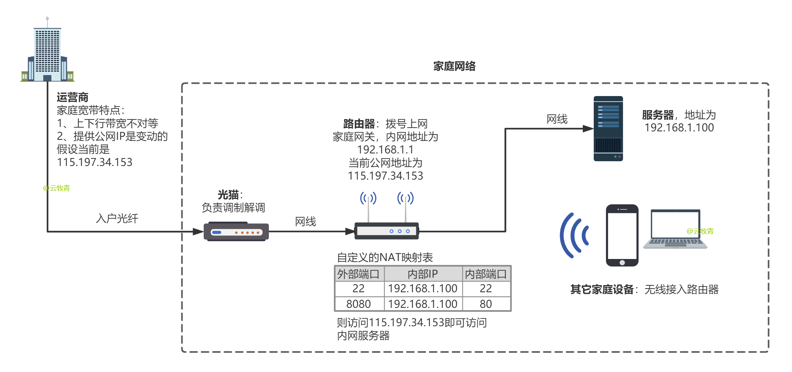

### 更新
2021-08-30 更新：使用子线程进行http连接，避免api错误导致主线程异常中断

2021-05-20 更新：从jdk11改为jdk8编译，增加了子域名的支持，适配Linux，修复bug

2020-12-08 更新：api从 https://202020.ip138.com/ 变为 https://2021.ip138.com/ 

### 背景
目前运营商给家庭宽带的IP都是动态的，庆幸的是虽然IP地址不固定，但分配到家庭路由器的却是一个实实在在的公网IP，所以我们只需使用**路由器NAT映射**（需要路由器支持，在管理台设置）即可在公网访问家庭的设备。我们路由器映射22端口就能远程家里的linux，映射445+3389端口就能用win10自带远程桌面远程家里的windows。如下图



为解决公网IP的变动，可以购买一个域名，使用DDNS（Dynamic Domain Name Server，动态域名服务）将域名解析到宽带的IP。这样就可以在家搭建各种服务并通过访问固定的域名来访问，而无需租用昂贵的公网服务器

想实现这个目的，你需要一台一直运行的电脑来运行此DDNS程序

### 简介
本程序仅适用于NameSilo上购买的域名

本程序通过访问 https://202020.ip138.com/ 获取家庭宽带的公网IP地址，通过 https://www.namesilo.com/api/ 来查询和更新DNS状态。如下图


### 注意
本程序只能更新域名的DNS记录，无法增加，请确保你的域名存在此DNS记录。

### 配置
为了运行这个程序，你需要安装Java，推荐jdk8。首次运行之前你需要配置_conf.txt文件，填写你<a href="https://guozh.net/obtain-namesilo-api-key/" target="_blank">从NameSilo获取</a>的api key，以及你的域名。还有一项可选的配置——程序去检查IP是否变动的频率。

### 运行
Windows ：直接双击win_runDDNS.bat

Linux &nbsp;&nbsp;&nbsp;&nbsp;&nbsp;&nbsp;：`chmod +x DDNS && ./DDNS start`

### 在开机时启动
Windows ：将vbs文件[加入策略组](https://blog.csdn.net/yunmuq/article/details/110199091)

Linux &nbsp;&nbsp;&nbsp;&nbsp;&nbsp;&nbsp;：首先`vi DDNS`在其中配置好java环境变量以及当前脚本文件、jar包所在目录，接着拷贝文件并注册服务

```
cp DDNS /etc/init.d/DDNS
chkconfig --add /etc/init.d/DDNS
# 查看服务是否注册成功
chkconfig --list
# reboot即可重启，检验是否自启成功
# 服务操作
service DDNS status  # 查看状态
service DDNS start   # 启动
service DDNS stop    # 停止
service DDNS restart # 重启
```

### 其他DDNS方案推荐
都是用到了curl发送请求，把响应保存到文件中 ，再用脚本处理字符串。

> Windows ：[https://www.v2ex.com/t/274392](https://www.v2ex.com/t/274392)
> 
> Linux &nbsp;&nbsp;&nbsp;&nbsp;&nbsp;&nbsp;：[https://github.com/pztop/namesilo_ddns](https://github.com/pztop/namesilo_ddns/blob/master/namesilo_ddns.sh)


还有一个Windows powershell脚本实现的

> [https://www.ctrol.cn/post/freesource/domain-host/05-25-cartev-4719.html](https://www.ctrol.cn/post/freesource/domain-host/05-25-cartev-4719.html)
